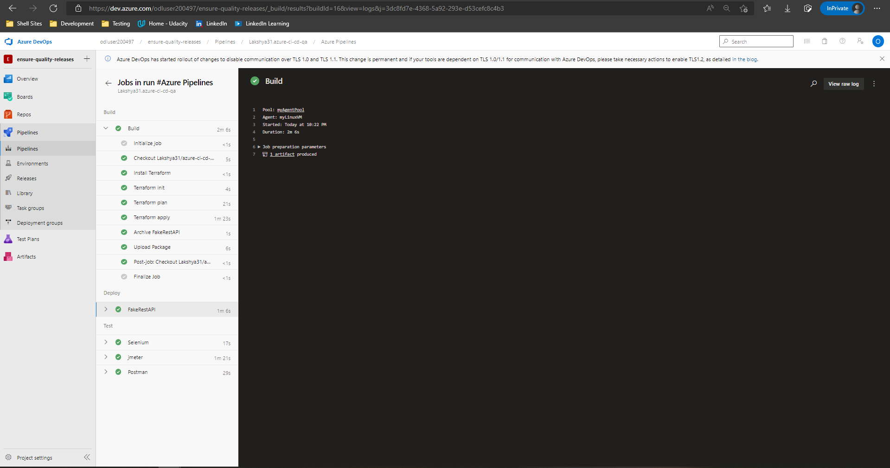
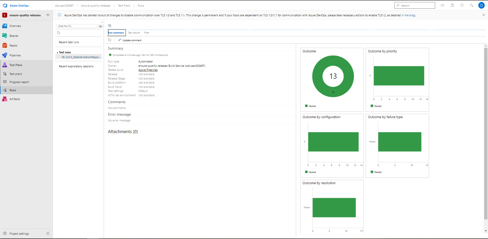
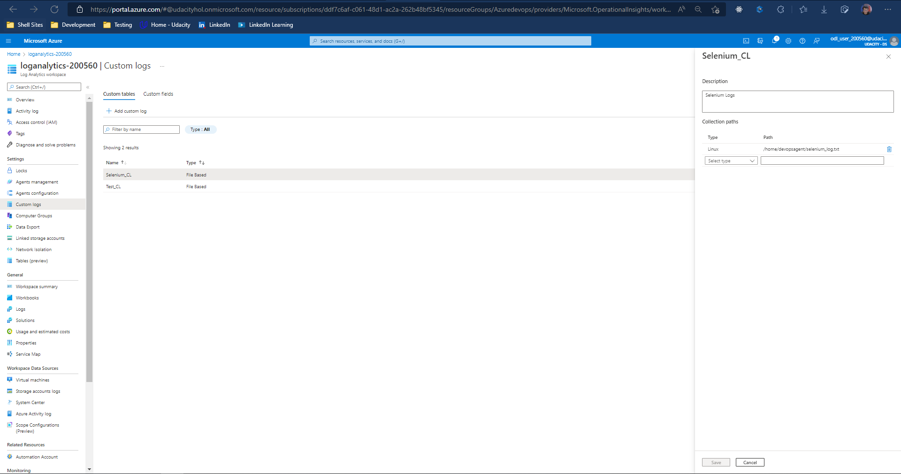

# Quality Assurance using CI/CD

This project implements IaC (Infrastructure as Code) using Terraform to deploy azure app services.

There is an Azure Pipeline implemented in the project which deploys code into the given app service, and performs Load Testing, UI Testing & API Testing.

## To run Terraform for deploying resources:
- Install Terraform
- Setup storage in Azure (https://docs.microsoft.com/en-us/azure/developer/terraform/store-state-in-azure-storage?tabs=azure-cli)
- Replace the values below in terraform/environments/test/main.tf with the output from the Azure CLI:
    storage_account_name
    container_name
    access_key
- Replace the below values in terraform/environments/test/terraform.tfvars with the output from the Azure CLI:
    subscription_id
    client_id
    client_secret
    tenant_id
- Configure variables in `./terraform/terraform.tfvars`

## To run UI Tests:
- Install Python 3.7
- Install pip
- Install selenium using `pip install selenium` preferably in a virtual environment.
- Run `python <path to ui_tests.py>`

## To run API Tests:
- Install npm
- Install newman using `npm install -g newman`
- Run `newman run ".\automatedtesting\postman\RegressionSuite.postman_collection.json" -e .\automatedtesting\postman\env.json --insecure`
- Run `newman run ".\automatedtesting\postman\DataValidationSuite.postman_collection.json" -e .\automatedtesting\postman\env.json --insecure`

## To run Performance Tests:
- Install Jmeter
- Run `jmeter -n -t automatedtesting/jmeter/Endurance_Test.jmx -l automatedtesting/jmeter/enduranceresults.jtl -e -o automatedtesting/jmeter/endurancereport`
- Run `jmeter -n -t automatedtesting/jmeter/Stress_Test.jmx -l automatedtesting/jmeter/stressresults.jtl -e -o automatedtesting/jmeter/stressreport`

## To trigger pipeline:
- Push a commit to master branch

## Proof through Screenshots:

- Successful Pipeline Run:

- Build Stage

- Terraform Apply Logs

- Selenium UI Test

- Endurance Test

- Stress Test

- Regression Test

- Data Validation Test

- Artifacts uploaded by Pipeline:

- Regression Testing Graphs

- Data Validation Testing Graphs

- Endurance Testing Dashboard

- Stress Testing Dashboard

- App Service Graph after Pipeline Run

- Custom Logs Setup

- Custom Logs

- Alert in Azure Portal

- Triggered Alert

